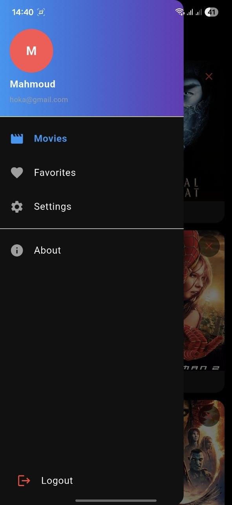
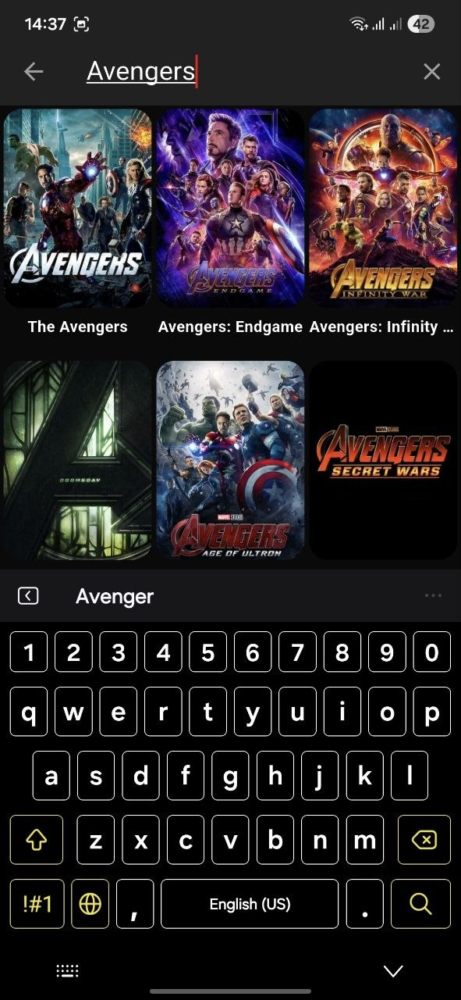
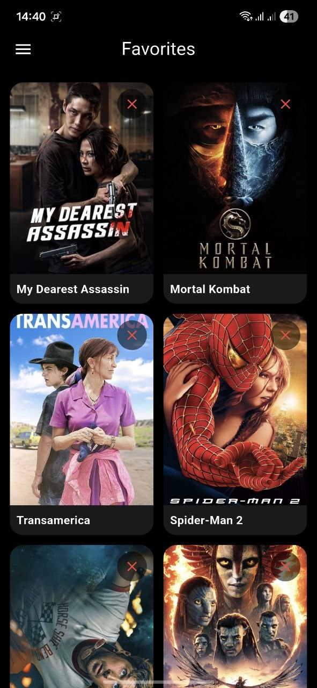

<div align="center">
  

# 🎬 CineVerse

**A beautifully designed, feature-rich Flutter application for movie discovery.**


[Explore Movies](#-features) • [Installation](#-getting-started) • [Architecture](#-architecture) • [Screenshots](#-screenshots)

</div>

---

## 📖 About The Project

**CineVerse** is an elegant, full-featured movie discovery application built with Flutter. Designed with a focus on clean code and scalable architecture, it integrates with **The Movie Database (TMDB) API** to fetch the latest trends, offers secure user authentication via **Firebase**, and provides robust local caching and favorites management using **Hive** and **Firestore**.

With a beautiful dark UI theme, smooth animations, and a responsive layout, CineVerse delivers a premium user experience across all devices.

## ✨ Features

- **Authentication System:** Secure email & password registration/login with Firebase Auth.
- **Movie Discovery:** Explore popular movies with infinite scrolling and pull-to-refresh capabilities.
- **Comprehensive Details:** View in-depth movie information, similar titles, and watch trailers.
- **Search Functionality:** Powerful search engine using Flutter's native `SearchDelegate`.
- **Favorites Management:** Save your favorite movies locally (Hive) and sync seamlessly with the cloud (Firestore).
- **Offline Support:** Local caching to ensure a smooth experience even with unstable connections.
- **Modern UI/UX:** A stunning, brand-aligned dark theme with engaging animations and a seamless splash screen to home flow.

## 📱 Screenshots


| Login | Sign Up | splash | App Drawer |
| :---: | :---: | :---: | :---: |
|  |  |  |  |

| Movies Screen | Movie Details | Search Screen | Favorites Screen |
| :---: | :---: | :---: | :---: |
|  |  |  |  |

## 🎥 App Demonstration

Check out the full app experience in our demo video:

<div align="center">
  👉 [Watch Demo Video](assets/demo/app_demo.mp4.mp4)
  
</div>

## 🏗️ Architecture

CineVerse follows the **Clean Architecture** principles, separating concerns into strictly defined layers to ensure maintainability, scalability, and testability. State management is handled robustly using the **BLoC (Business Logic Component)** pattern.

| Layer | Responsibility |
| :--- | :--- |
| **Domain** | Contains the core business logic: Entities, Use Cases, and Repository Contracts. |
| **Data** | Handles data retrieval: Remote sources (Dio + TMDB), Local sources (Hive), and Repository Implementations. |
| **Presentation** | UI components: Screens, Widgets, and BLoCs for state management. |

Dependency Injection is centralized and managed via GetIt in `lib/injection_container.dart`.

## 🛠️ Tech Stack

- **Framework:** [Flutter](https://flutter.dev/)
- **Language:** [Dart](https://dart.dev/)
- **State Management:** [flutter_bloc](https://pub.dev/packages/flutter_bloc)
- **Networking:** [Dio](https://pub.dev/packages/dio)
- **Local Storage:** [Hive](https://pub.dev/packages/hive)
- **Backend/Auth:** [Firebase Auth](https://firebase.google.com/products/auth) & [Cloud Firestore](https://firebase.google.com/products/firestore)

## 🚀 Getting Started

To get a local copy up and running, follow these simple steps.

### Prerequisites

- [Flutter SDK](https://docs.flutter.dev/get-started/install) (`^3.11.5` or higher)
- A [TMDB API v3 key](https://www.themoviedb.org/documentation/api)
- A configured [Firebase Project](https://firebase.google.com/)

### Installation

1. **Clone the repository**
   ```bash
   git clone https://github.com/MahmoudAbogamihe/movie_app.git
   cd movie_app
   ```

2. **Install dependencies**
   ```bash
   flutter pub get
   ```

3. **Configure Firebase**
   - Register your app in your Firebase project.
   - For Android: Place `google-services.json` in `android/app/`.
   - For iOS: Place `GoogleService-Info.plist` in `ios/Runner/`.
   - Alternatively, regenerate `firebase_options.dart`:
     ```bash
     dart pub global activate flutterfire_cli
     flutterfire configure
     ```

4. **Run the App**
   The app requires your TMDB API key to run. Pass it at compile time:
   ```bash
   flutter run --dart-define=TMDB_API_KEY=YOUR_TMDB_KEY
   ```
   *For release builds:*
   ```bash
   flutter build apk --dart-define=TMDB_API_KEY=YOUR_TMDB_KEY
   ```

### Code Generation

If you modify or add new Hive type adapters, rebuild the generated files:
```bash
dart run build_runner build --delete-conflicting-outputs
```

## 🔒 Security Notes

- **Never commit** your TMDB API keys or Firebase server secrets (`google-services.json`, `GoogleService-Info.plist`) to version control.
- `ApiConstants.apiKey` is loaded securely via `String.fromEnvironment('TMDB_API_KEY')`.
- It is highly recommended to restrict your Firebase API keys in the Google Cloud Console.

## 📁 Project Structure

```text
lib/
 ├── core/                  # Theme, constants, network layer, shared widgets
 ├── features/
 │   ├── authentication/    # Auth logic, login, registration screens
 │   └── movies/            # Movie fetching, details, search, favorites
 ├── firebase_options.dart  # Generated Firebase config
 ├── injection_container.dart # Dependency injection setup
 └── main.dart              # App entry point
```

## 📜 License

Distributed under the MIT License. See `LICENSE` for more information.

---

<div align="center">
  <b>Built with ❤️ using Flutter</b>
</div>
